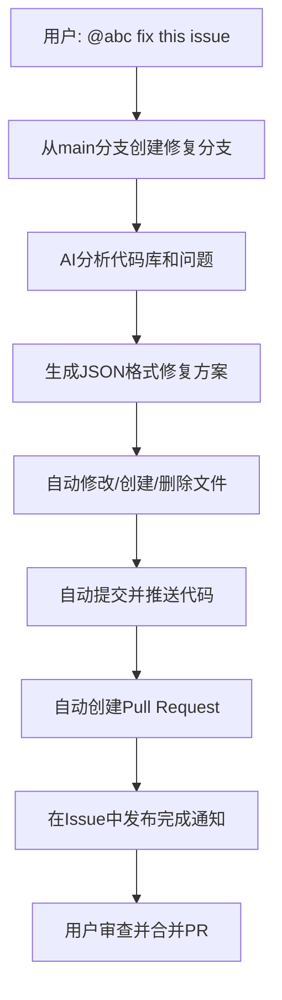

# 🤖 AI助手自动代码修改功能增强说明

## 🎯 **重大更新概览**

基于用户需求，AI助手现已具备**完整的自动代码操作能力**！从分析问题到创建PR，全流程自动化，同时保留人工审查环节确保安全。

## 🚀 **新增功能特性**

### 1️⃣ **智能问题修复器全面升级**

#### **🔧 自动代码操作能力**
- ✅ **创建新文件** - AI可以生成全新的代码文件
- ✅ **修改现有文件** - 智能替换代码片段或完整文件内容
- ✅ **删除不需要的文件** - 清理冗余或有问题的文件
- ✅ **智能目录管理** - 自动创建必要的目录结构

#### **🌿 完整Git工作流**
- ✅ **从main分支拉取** - 确保基于最新代码进行修复
- ✅ **自动分支创建** - 命名格式: `fix/issue-{编号}-{时间戳}`
- ✅ **智能代码提交** - AI生成有意义的commit消息
- ✅ **自动推送到远程** - 无需手动Git操作

#### **🔄 PR自动化管理**
- ✅ **自动创建PR** - 包含详细的修复说明
- ✅ **智能标签标记** - 标识为`ai-generated`, `needs-review`
- ✅ **结构化PR描述** - 包含问题分析、文件变更、测试建议
- ✅ **分配给创建者** - 自动分配给Issue创建者审查

### 2️⃣ **高级JSON响应系统**

#### **结构化AI输出**
```json
{
  "analysis": {
    "root_cause": "详细根因分析",
    "severity": "low|medium|high|critical",
    "impact_scope": "影响范围描述",
    "fix_strategy": "修复策略概述"
  },
  "file_modifications": [
    {
      "file_path": "相对路径/文件.ext",
      "action": "create|modify|delete",
      "description": "变更说明",
      "content": "完整文件内容(create/modify)",
      "old_content": "要替换的内容(modify)",
      "new_content": "新内容(modify)"
    }
  ],
  "test_suggestions": ["测试建议1", "测试建议2"],
  "commit_message": "规范化提交信息",
  "pr_description": "详细PR描述",
  "additional_notes": "重要注意事项"
}
```

### 3️⃣ **智能安全保障机制**

#### **多层次验证**
- 🔍 **JSON格式验证** - 确保AI响应格式正确
- 📁 **文件路径验证** - 防止不安全的文件操作
- 📝 **变更内容审查** - 人工审查所有代码更改
- 🏷️ **智能标签管理** - 清晰标识AI生成内容

#### **错误处理和降级**
- ❌ **自动失败处理** - 提供详细的失败原因和建议
- 🔄 **智能重试机制** - 支持用户重新触发修复
- 📋 **备用分析模式** - 即使PR创建失败也提供分析结果
- 💡 **用户指导** - 提供明确的下一步操作建议

## 🎮 **使用方法**

### **🔧 自动修复命令**
```bash
# 在Issue中评论，触发完整自动修复
@abc fix this issue
```

### **完整工作流程**


### **🎯 实际示例**

**用户输入**:
```
Issue #123: 用户登录后页面白屏

@abc fix this issue
```

**AI自动执行**:
1. 📊 分析项目结构和错误
2. 🌿 创建分支 `fix/issue-123-20241201-143022`
3. 💻 修改 `src/components/Login.jsx` - 修复状态管理
4. ✨ 创建 `src/utils/errorHandler.js` - 添加错误处理
5. 📝 提交: `fix: resolve login white screen issue #123`
6. 🔄 创建PR: `🤖 AI自动修复: 用户登录后页面白屏`
7. 📋 发布完成通知到Issue

**结果**:
- ✅ 修复分支已就绪
- ✅ PR等待审查
- ✅ 详细修复说明
- ✅ 测试建议提供

## 🛡️ **安全特性**

### **权限控制**
- 📝 `contents: write` - 代码修改权限
- 🔄 `pull-requests: write` - PR创建权限
- 🏷️ `issues: write` - Issue标签管理
- 🔐 支持GitHub App Token安全认证

### **审查机制**
- 👀 **强制人工审查** - 所有PR需要审查才能合并
- 🏷️ **AI标识标签** - 清晰标记AI生成内容
- 📋 **详细变更日志** - 完整记录所有修改
- ⚠️ **安全提示** - PR中包含安全审查建议

### **回滚保障**
- 🌿 **独立分支** - 不直接修改main分支
- 📝 **完整历史** - 保留所有Git提交历史
- 🔄 **轻松回滚** - 可以随时关闭或回滚PR
- 🛡️ **权限分离** - 创建者和审查者分离

## 📋 **支持的修复类型**

### **Bug修复** (`bug`)
- 🐛 逻辑错误修复
- 💥 异常处理增强
- 🔧 性能问题解决
- 🛡️ 安全漏洞修补

### **性能优化** (`performance`)
- ⚡ 算法优化
- 📈 内存管理改进
- 🚀 加载速度提升
- 📊 数据库查询优化

### **功能增强** (`enhancement`)
- ✨ 新功能实现
- 🎨 UI/UX改进
- 📚 文档完善
- 🧪 测试覆盖增加

### **安全修复** (`security`)
- 🔒 认证机制加强
- 🛡️ 输入验证完善
- 🔐 数据加密改进
- 🚫 权限控制优化

## 🎉 **立即体验**

### **快速测试**
1. 创建一个测试Issue，描述具体的代码问题
2. 在Issue中评论: `@abc fix this issue`
3. 等待AI分析并自动修复（约2-5分钟）
4. 审查创建的PR并测试修复效果
5. 满意后合并PR，关闭Issue

### **最佳实践建议**
- 📝 **详细描述问题** - 包含错误信息、复现步骤、代码片段
- 🧪 **提供测试案例** - 帮助AI理解预期行为
- 📋 **明确修复范围** - 说明哪些文件或功能需要修改
- 👥 **及时审查PR** - 仔细检查AI生成的代码更改

AI助手现在真正成为了您的**自动化开发伙伴**！🚀✨
