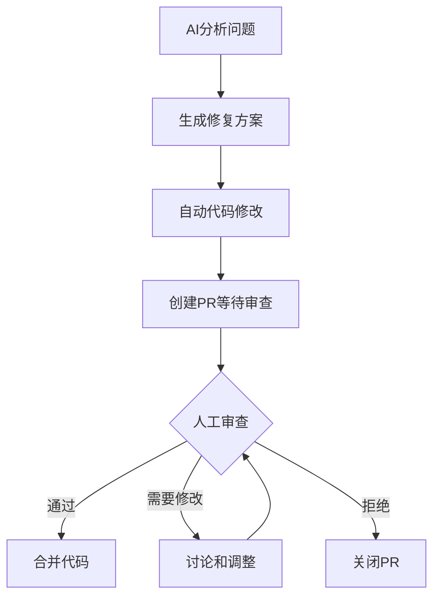

# 🤖 完整AI代码操作系统使用指南

## 🎯 **系统概览**

恭喜！您现在拥有了一个**完整的AI代码操作生态系统**，包含两个互补的AI助手：

### **1️⃣ 智能助手命令处理器** (`@abc` 命令)
- 🔍 **智能分析和建议** - 提供详细的技术分析
- 📝 **简单代码生成** - 自动创建单个文件或小代码片段
- 💬 **交互式对话** - 与用户进行技术讨论
- 📋 **项目规划** - 提供实施步骤和最佳实践

### **2️⃣ 智能问题修复器** (`@abc fix this issue`)
- 🔧 **完整问题修复** - 从分析到PR的全自动化流程
- 🌿 **完整Git工作流** - 分支创建、提交、推送、PR创建
- 💻 **复杂代码操作** - 多文件修改、删除、重构
- 🛡️ **企业级安全** - 完整的审查和回滚机制

## 🎮 **使用方法对比**

### **📋 智能助手 vs 问题修复器**

| 功能 | 智能助手 (`@abc`) | 问题修复器 (`@abc fix this issue`) |
|------|-------------------|-----------------------------------|
| **触发方式** | `@abc 任何问题` | `@abc fix this issue` |
| **代码操作** | 简单文件创建/修改 | 完整代码修复和重构 |
| **Git操作** | 无 | 完整Git工作流 |
| **PR创建** | 无 | 自动创建PR |
| **适用场景** | 分析、建议、简单生成 | 复杂bug修复、功能实现 |
| **交互模式** | 对话式交流 | 一次性完整修复 |

### **🎯 选择建议**

#### **使用智能助手 (`@abc`) 当你想要：**
- 💭 **获取分析和建议** - "这个错误可能的原因是什么？"
- 📝 **生成简单代码** - "创建一个工具函数文件"
- 📋 **制定计划** - "如何重构这个模块？"
- 💡 **获取最佳实践** - "性能优化的建议"
- 🎓 **学习和讨论** - "这个技术方案的优缺点"

#### **使用问题修复器 (`@abc fix this issue`) 当你想要：**
- 🐛 **修复具体Bug** - 页面白屏、功能异常、性能问题
- ✨ **实现新功能** - 完整的功能模块开发
- 🔧 **代码重构** - 大规模代码结构调整
- 🛡️ **安全修复** - 漏洞修补和安全加强
- ⚡ **性能优化** - 系统性能改进

## 🎯 **实际使用示例**

### **💭 场景1: 分析和建议**
```
@abc 用户反馈页面加载很慢，如何排查性能问题？
```
**AI助手响应**:
- 📋 详细分析可能的性能瓶颈
- 💡 提供排查步骤和工具建议
- 📊 给出优化策略和最佳实践
- 🎯 可能创建性能监控配置文件

### **🔧 场景2: 自动修复**
```
Issue: 用户登录后页面白屏，控制台显示状态管理错误

@abc fix this issue
```
**问题修复器执行**:
1. 🔍 分析项目结构和错误原因
2. 🌿 创建修复分支 `fix/issue-123-20241201`
3. 💻 修改状态管理逻辑
4. ✨ 创建错误处理组件
5. 📝 自动提交和推送
6. 🔄 创建详细的PR
7. 📋 在Issue中报告完成状态

### **📝 场景3: 简单代码生成**
```
@abc 创建一个API请求的工具类，包含错误处理和重试机制
```
**AI助手响应**:
- 📋 分析API工具类的设计思路
- ✨ 自动创建 `utils/apiClient.js` 文件
- 💻 包含完整的错误处理和重试逻辑
- 📚 提供使用示例和最佳实践

## 🚀 **高级功能特性**

### **🤖 智能助手增强功能**

#### **自动代码生成判断**
AI会智能判断请求是否适合自动生成代码：
```javascript
// AI内部判断逻辑
{
  "can_auto_implement": true,  // 可以自动实现
  "simple_file_operations": [
    {
      "action": "create",
      "file_path": "utils/helper.js",
      "content": "// 完整的工具类代码",
      "description": "通用工具函数集合"
    }
  ]
}
```

#### **灵活的操作类型**
- ✨ **创建新文件** - 从零开始生成代码
- 📝 **修改现有文件** - 智能更新代码内容
- 📁 **目录管理** - 自动创建必要的目录结构

### **🔧 问题修复器完整流程**

#### **高级JSON响应格式**
```json
{
  "analysis": {
    "root_cause": "状态管理初始化时机问题",
    "severity": "high",
    "impact_scope": "所有登录用户",
    "fix_strategy": "修复状态初始化逻辑并添加错误边界"
  },
  "file_modifications": [
    {
      "file_path": "src/store/userStore.js",
      "action": "modify", 
      "old_content": "// 问题代码",
      "new_content": "// 修复后代码"
    },
    {
      "file_path": "src/components/ErrorBoundary.jsx",
      "action": "create",
      "content": "// 完整的错误边界组件"
    }
  ],
  "test_suggestions": [
    "测试登录流程在各种网络状况下的表现",
    "验证错误边界能正确捕获和处理异常"
  ]
}
```

#### **智能Git工作流**
```bash
# 自动执行的Git操作
git fetch origin main
git checkout main  
git pull origin main
git checkout -b fix/issue-123-20241201-143022

# AI修改代码文件
# ...

git add .
git commit -m "fix: resolve login white screen issue #123"
git push origin fix/issue-123-20241201-143022

# 自动创建PR
gh pr create --title "🤖 AI自动修复: 用户登录后页面白屏" \
  --body "详细的修复说明..." \
  --label "ai-generated,needs-review"
```

## 🛡️ **安全和质量保障**

### **多层安全机制**
1. **🔍 代码审查必需** - 所有AI生成的代码都需要人工审查
2. **🏷️ 清晰标识** - AI生成内容有明确的标签标识
3. **📋 详细日志** - 完整记录所有操作过程
4. **🔄 轻松回滚** - 可以随时关闭或回滚PR
5. **🌿 分支隔离** - 不直接修改主分支

### **质量控制流程**


## 🎯 **最佳实践建议**

### **📝 如何写好请求**

#### **智能助手请求示例**
```
✅ 好的请求:
@abc 分析一下为什么React组件重复渲染，并创建一个性能监控Hook

❌ 不好的请求:
@abc 帮我
```

#### **问题修复器请求示例**
```
✅ 好的Issue描述:
标题: 用户上传图片后界面卡死
描述: 
- 错误现象: 点击上传按钮后页面无响应
- 浏览器控制台错误: "Cannot read property 'size' of undefined"
- 复现步骤: 1.登录 2.进入设置页面 3.点击头像上传
- 影响范围: 所有用户
- 期望结果: 能正常上传图片并更新头像

@abc fix this issue

❌ 不好的Issue:
有个bug，修一下
@abc fix this issue
```

### **📊 使用策略**

#### **日常开发工作流**
1. **🔍 问题发现** - 发现bug或需要实现功能
2. **📝 详细描述** - 创建Issue并详细描述问题
3. **🤖 AI助手咨询** - 使用`@abc`获取分析和建议
4. **🔧 自动修复** - 对于复杂问题使用`@abc fix this issue`
5. **👀 代码审查** - 仔细审查AI生成的PR
6. **🧪 测试验证** - 运行测试确保修复有效
7. **✅ 合并部署** - 确认无误后合并代码

#### **团队协作模式**
- 🎯 **问题报告者** - 创建详细的Issue描述
- 🤖 **AI助手** - 自动分析并生成修复方案
- 👨‍💻 **代码审查者** - 审查AI生成的代码更改
- 🧪 **测试工程师** - 验证修复效果
- 📋 **项目经理** - 跟踪修复进度和质量

## 🎉 **立即开始使用**

### **快速测试流程**

#### **1. 测试智能助手**
```
@abc 分析当前项目的技术栈，并建议一个日志记录系统的实现方案
```

#### **2. 测试问题修复器**
1. 创建一个测试Issue
2. 描述一个具体的代码问题
3. 评论: `@abc fix this issue`
4. 等待AI自动修复（2-5分钟）
5. 审查生成的PR

### **期待的体验**
- ⚡ **快速响应** - 通常在2-5分钟内完成分析和修复
- 🎯 **精准修复** - AI能理解问题并提供针对性解决方案
- 📋 **详细文档** - 完整的修复说明和操作指引
- 🛡️ **安全可靠** - 所有更改都需要人工审查确认

**🚀 您现在拥有了一个真正智能的AI开发助手！从简单的技术咨询到复杂的代码修复，AI助手将大大提升您的开发效率！**
